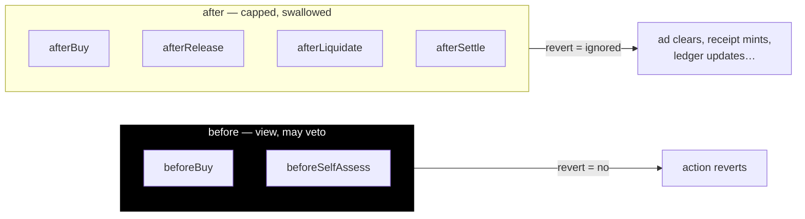
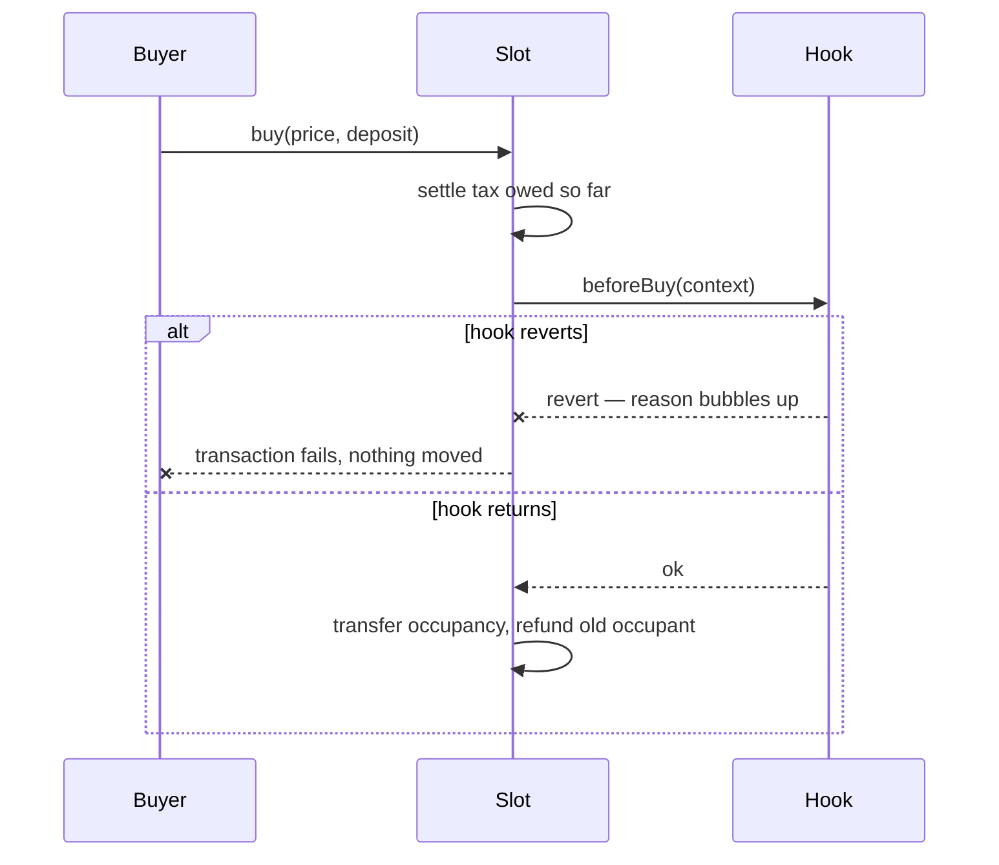
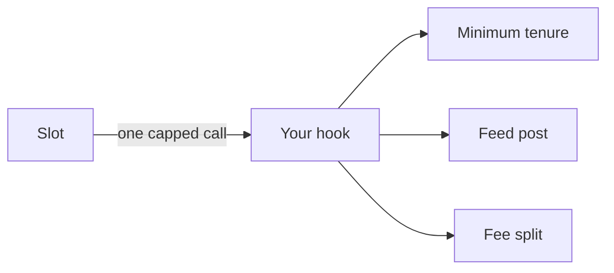

import { Callout } from 'vocs'

# Hooks

A slot on its own is a position and nothing more. Holding it grants no rights
and refuses no buyer, because there is nothing attached to decide either.

A **hook** is the one way to extend a slot — the ad that renders, the name that
resolves, the feed you post to, the seven-day tenure nobody outbids you through.
One interface does both jobs: what holding *grants*, and who may *hold*.

<Callout type="info">
A slot points at a single `ISlotHook`. One address decides both what holding
grants and who may hold — there is nothing else to wire up. Everything below is
that one interface.
</Callout>

Set one at creation, or leave it empty for a bare, instant-buy slot.

## The whole rule

> `before` decides and may refuse. `after` records and cannot.

Every other property of a hook falls out of that one line:

- **`before*` callbacks are `view`.** They cannot write, so they cannot reenter,
  so they are safe to call without a gas cap. Their only power is to **revert** —
  which vetoes the action. This is the "who may hold" half.
- **`after*` callbacks are gas-capped, and their revert is swallowed.** They run
  after the action has settled and cannot change its outcome — so a broken hook
  can never block a buy, and above all can never block a **liquidation**, which
  the protocol treats as unconditional. This is the "what holding does" half:
  clear the ad, mint a receipt, update a ledger.
- **Unless the hook declares `strict`.** Then its `after*` callbacks run uncapped
  and their revert propagates, so work that must land cannot be silently dropped
  — and the hook can fail the slot, eviction included. The declaration is
  snapshotted when the hook attaches and published in `SlotInfo.hookFlags`, so
  it is a fact about the slot rather than a surprise inside it.

There is deliberately no way to write during `before`. A hook that wants to
record something about a decision does it in the matching `after`.

## The six callbacks

One context struct — `SlotContext` — is passed to all of them; fields that
aren't meaningful for a callback are zero.

| Callback | Kind | Fires |
|---|---|---|
| `beforeBuy` | decide | someone tries to buy the slot |
| `beforeSelfAssess` | decide | the occupant re-prices |
| `afterBuy` | record | a buy went through |
| `afterRelease` | record | the occupant left |
| `afterLiquidate` | record | an insolvent occupant was removed |
| `afterSettle` | record | tax was charged |



There is no `beforeSell` or `afterSell`. `Slot.sell` was removed — a consensual
sale is `selfAssess` then `buy`, performed by the OfferBook — so a sale runs
`beforeSelfAssess` and `beforeBuy` like any other seating. One seating path, one
set of checks, and no second door for a hook to have forgotten.

A hook declares which callbacks it wants in a **`HookFlags`** struct, read once
when it is attached and then **snapshotted** — never re-read. A hook that could
widen its own reach mid-tenure could start charging an occupant gas they never
agreed to.

## Fail-closed, on purpose

A `before` hook that reverts, is broken, or is not a hook at all makes the
action **fail**. A rule about who may take your property should never be
skippable because a contract had a bad day.



The `after` side is the mirror image: capped and swallowed, so a broken effect
degrades to "the slot grants nothing" rather than "the slot is frozen."

## What no hook can do

A hook decides and records. It **cannot** move funds, change the price, or
redirect the buyer — and two escape hatches bypass the `before` side entirely:

- **`liquidate()`** — an insolvent occupant can always be removed. Otherwise a
  hook could keep someone in a slot they have stopped paying for.
- **`release()`** — an occupant can always leave. Otherwise a hook could trap
  you in a position you no longer want.

The worst a bad hook can do is stop *new* people arriving. It can never strand
money or trap a person.

<Callout type="warning">
A hook may only ever say **no** to occupancy timing, never touch price. Harberger
works because the tax and the forced sale pull against each other; let a hook
move the price and under-declaring becomes profitable, which inverts the whole
mechanism. The tax stops being a truth serum and becomes a fee you dodge.
</Callout>


## Many behaviours: one hook

A slot points at **exactly one** hook, and the core makes **one** capped call
into it per callback. To want several behaviours — a minimum tenure *and* a feed
*and* a fee — you write one hook that does all three.

One contract, one stipend, one `msg.sender`: every callback costs a known
maximum, and the slot is always the caller. A hook that needs configuration owns
the slot's whole `hookData` word and decides for itself what the bytes mean.



## Naming what a hook is

A hook is just an address; on its own it says nothing to a UI. A hook may
*optionally* implement `IDescribedHook`, returning `HookDescriptor`s that carry
a `family`, a `version`, and a `metadataURI` for the human label ("7-day minimum
tenure", not `tenureSeconds: 604800`).

<Callout type="info">
Discovery is **client-only** and untrusted. The slot never reads a descriptor —
it is self-reported and unbounded, and the moment the protocol trusted it, a
label would become an attack surface on the path liquidation depends on. A UI
says "this hook *claims* to be a 7-day tenure"; whatever list that interface
keeps is the upgrade to "and we vouch for it." Authority is always the
snapshotted flags, never the label.
</Callout>

## Verifying a hook

Each hook kind ships with a factory that deploys it at a CREATE2 address derived
from its terms, so verification is one call:

```solidity
factory.verify(hook) // → bool
```

CREATE2 binds an address to the deployer, the init code *and* the salt, so only
the genuine hook for those exact terms can sit there. That is why a client can
name a hook it has never seen — it asks each known factory "did you make this?"
rather than consulting a hardcoded list.

## Next

- [How a slot works](/concepts/slots) — the position the hook extends
- [Hook reference](/reference/hooks) — `ISlotHook`, `SlotContext`, the structs
- [Slot reference](/reference/slot) — the full contract API
