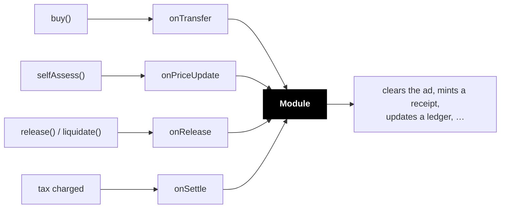

import { Callout } from 'vocs'

# Utility modules

A slot on its own is a position and nothing more. Holding it grants you no
rights, because there is nothing attached to grant.

A **module** is what makes holding worth something: the ad that renders, the
name that resolves, the feed you can post to, the door that opens.

**The slot is the plot. The module is the crop.**

Set one at creation, or leave it empty.

## Available modules

| Module | Holding the slot means | Fee |
|---|---|---|
| **Metadata** | your content appears here — ads, listings, profiles | none |
| **Feed post** | you may publish into a feed | none |

Metadata is the workhorse. The occupant sets a URI and structured data; it
clears when they leave.

## Hooks

The slot tells its module what happened. The module does what it likes with
that.

| Hook | Fires when |
|---|---|
| `onTransfer` | occupancy moves |
| `onPriceUpdate` | occupant self-assesses |
| `onRelease` | occupant leaves or is liquidated |
| `onSettle` | tax is charged |

Three report **occupancy** — who holds the slot. `onSettle` reports **money**.

## Fees

A module can take a cut of the tax via `feeBps` and `feeRecipient`, skimmed at
collection. The rest goes to the recipient.

That is how a module author gets paid for building something on a slot they do
not own. It is declared by the module and visible before anyone commits.

## Writing one

Any contract implementing `IUtility` — the interface formerly called
`ISlotsModule`, kept as an alias so existing utilities keep compiling. No
registry, no permission: pass its address at slot creation.

You also need [`IModuleMetadata`](/reference/modules) — `name`, `version`,
`metadataURI` — which `IUtility` inherits. Verification checks both ERC-165 ids
separately, so a utility that implements the hooks but cannot describe itself
will not verify.

The factory can mark a module **verified**, which is a curation signal in the
explorer, not a security boundary. Unverified modules work identically.

Practical notes:

- Keep hooks cheap. They run inside user transactions under a gas cap.
- Key state by `msg.sender` — one module usually serves many slots.
- Never assume a hook arrived. See below.

---

## Design notes

### Modules are fail-open

If a module reverts, runs out of gas, or is simply broken, **the slot carries on
regardless**. The call is gas-capped and the failure is swallowed.

This is the exact opposite of an [occupancy policy](/concepts/occupancy), and
the asymmetry is the point:

| | Occupancy policy | Utility module |
|---|---|---|
| Answers | may this happen? | this happened |
| On failure | **blocks the action** | **ignored** |
| Can move funds | never | takes a fee from tax |

A rule about who may take your property must be reliable, so a broken policy
stops everything. A feature attached to a slot must never freeze the money
underneath it, so a broken module is skipped.

<Callout type="warning">
A module must therefore never be the **source of truth** for anything financial.
If it misses a call, nothing tells it. For accounting, reduce over the `TaxPaid`
event — it always fires, regardless of what the module did.
</Callout>

### paid is not owed

`onSettle` carries both what was owed and what was actually paid, and they
differ. A charge is capped by the remaining deposit, so an occupant running dry
pays less than they owe.

Anything doing revenue share or contribution accounting must use `paid`.
Reconstructing it from price × time computes `owed` and over-credits — and
someone can trigger that deliberately by declaring a huge price against a tiny
deposit.

### onSettle fires mid-transaction

Unlike the other hooks, it runs from inside the settlement that begins every
mutating call. The slot is in its pre-operation state — during a `buy`,
`occupant()` still returns the outgoing occupant. Reentry into the same slot is
blocked, but treat anything you read as in flux.

## Next

- [Module reference](/reference/modules) — the interface in full
- [Occupancy](/concepts/occupancy) — controlling when the slot changes hands
