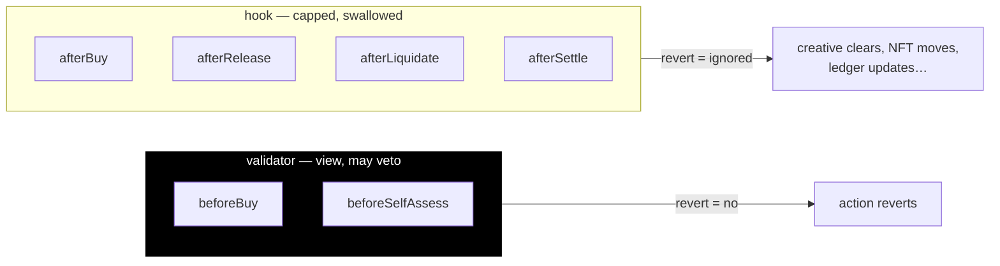
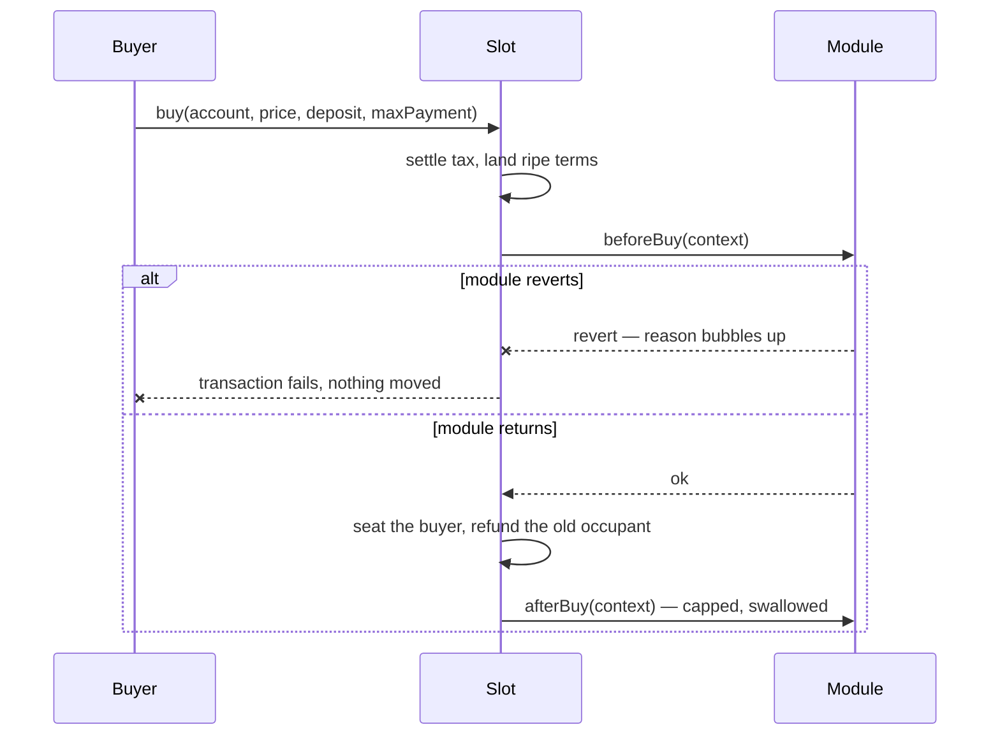
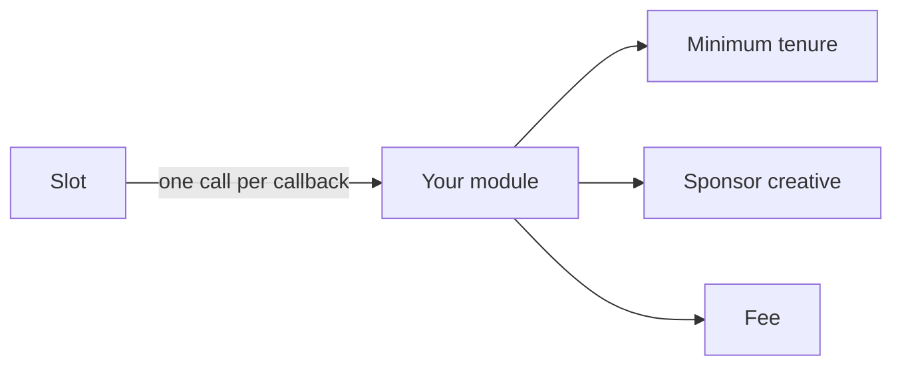

import { Callout } from 'vocs'

# Modules

A slot on its own is a position and nothing more. Holding it grants no rights
and refuses no buyer, because there is nothing attached to decide either.

A **module** is the one way to extend a slot — the sponsor creative that
renders, the NFT that follows the occupant, the seven-day tenure nobody outbids
you through. A slot installs **at most one**, as `ModuleTerms { target, settings }`,
at creation or later through its manager. Leave it empty for a bare,
instant-buy slot.

## The whole rule

> `before` decides and may refuse. `after` records and cannot.

Every other property of a module falls out of that one line:

- **`before*` callbacks are `view`.** The slot staticcalls them without a gas
  cap — a `view` cannot write, so it cannot reenter. Their only power is to
  **revert**, which vetoes the action, and the module's own error bubbles up.
- **`after*` callbacks are gas-capped and their revert is swallowed.** They run
  after the action has settled, on `MODULE_GAS` (500,000), and a failure is
  logged as `ModuleCallFailed` and otherwise ignored. A broken module can never
  block a buy, and above all can never block a **liquidation**.
- **Unless the module declares `strict`.** Then its `after*` callbacks run
  uncapped and their revert propagates, so work that must land — a mint, a
  transfer — cannot be silently dropped. The price is that the slot is only as
  evictable as the module.

There is deliberately no way to write during `before`. A module that wants to
record something about a decision does it in the matching `after`.

## Validators and hooks

Borrowing the vocabulary of ERC-7579, a module can be described by what its
scopes let it do:

- A module with **`before*` scopes acts as a validator.** It can refuse a buy
  or a self-assessment. View-only, uncapped.
- A module with **`after*` scopes acts as a hook.** It records what happened.
  Gas-capped, and cannot block anything unless it declares `strict`.

One module can be both — `MinimumTenureModule` and AdLand are. These are
labels, not interfaces: every module implements the same `ISlotModule`, and a
slot still installs exactly one.

## The callbacks

A slot calls only the ones its module declared. One context struct —
`SlotContext` — is passed to all of them; fields that aren't meaningful for a
callback are zero.

| Callback | Acts as | Fires |
|---|---|---|
| `beforeBuy` | validator | someone tries to buy the slot |
| `beforeSelfAssess` | validator | the occupant (or their operator) reprices |
| `afterBuy` | hook | a buy went through |
| `afterRelease` | hook | the occupant left |
| `afterLiquidate` | hook | an insolvent occupant was removed |
| `afterSettle` | hook | tax was taken from the deposit |
| `onInstall` | hook | the module became this slot's module |
| `onUninstall` | hook | the module is being replaced or removed |

```mermaid
flowchart LR
    subgraph decide["validator — view, may veto"]
        BB["beforeBuy"]
        BA["beforeSelfAssess"]
    end
    subgraph record["hook — capped, swallowed"]
        AB["afterBuy"]
        AR["afterRelease"]
        AL["afterLiquidate"]
        AT["afterSettle"]
    end
    decide -->|revert = no| Veto["action reverts"]
    record -->|revert = ignored| Effect["creative clears, NFT moves,<br/>ledger updates…"]

    classDef d fill:#000,stroke:#000,color:#fff
    class decide d
```

`onUninstall` is always capped and swallowed, `strict` or not: a module that
could refuse its own removal could never be replaced.

There is no sell callback. A sale through the [OfferBook](/reference/book) is
`selfAssess` then `buy`, so it runs `beforeSelfAssess` and `beforeBuy` like any
other seating — one seating path, one set of checks.

## Scopes and fee

A module says what it wants from a slot in two reads:

- `scopes(settings)` — the callbacks it needs, as bits.
- `fee(settings)` — an optional share of collected tax (`bps`, paid to `recipient`).

Both take the slot's `settings`, so the answer can depend on them: AdLand asks
for its `before` scopes only when the config sets a tenure window.

The slot **copies** both when the module is installed and never re-reads them on
a callback or a payout. The slot only calls the callbacks the copy lists —
which matters for the `before` side: calling one on a contract that does not
implement it would revert, and a reverting `before` vetoes every buy.

A module may later declare something different. The slot keeps its copy until
the manager accepts the new value, and the two follow different rules:

- **`acceptFee(expected)`** applies at once. It only changes how collected tax
  is split between the module and the recipient, never what an occupant pays,
  and tax collected so far is paid out under the old fee first. A fee can be
  anything up to all of the rent, but **raising** one — or attaching a module
  that charges at all — needs a slot whose recipient is mutable.
- **`acceptScopes(expected)`** queues: new scopes change what the module may do
  to an occupant, so they land at the next buy, and only on a slot whose module
  is mutable.

A module **proposed** as a replacement is checked the same way. The slot keeps
the scopes and fee it read at proposal in `pending()`, reads the module again
when it lands, and drops it instead of installing it if either differs — so the
delay cannot be used to raise a fee or add `strict` after the manager looked.

## Settings

`settings` are bytes stored **on the slot** and handed back in every callback
as `ctx.moduleTerms.settings`: `abi.encode` of the fields the module's
definition lists. It is what lets one deployment serve every
configuration: a seven-day and a thirty-day minimum tenure point at the same
`MinimumTenureModule`, each with its own window.

Because it lives on the slot, a slot whose module is immutable has both halves
frozen — which module, and how it is configured. A module keeping the setting
in its own storage could rewrite a slot's rules while the slot went on
reporting itself immutable.

The slot asks `checkSettings(settings)` whenever a module is proposed or
installed. A module that rejects its configuration is refused there, rather than
installed and vetoing every buy afterwards. There is no size limit: large
settings cost whoever builds and uses the slot, and they can see them first.

## Fail-closed, on purpose

A validator that reverts — on purpose or because it is broken — makes the
action **fail**. A rule about who may take your property should never be skippable
because a contract had a bad day.

```mermaid
sequenceDiagram
    participant B as Buyer
    participant S as Slot
    participant M as Module

    B->>S: buy(account, price, deposit, maxPayment)
    S->>S: settle tax, land ripe terms
    S->>M: beforeBuy(context)
    alt module reverts
        M--xS: revert — reason bubbles up
        S--xB: transaction fails, nothing moved
    else module returns
        M-->>S: ok
        S->>S: seat the buyer, refund the old occupant
        S->>M: afterBuy(context) — capped, swallowed
    end
```

The hook side is the mirror image: capped and swallowed, so a broken effect
degrades to "the slot grants nothing" rather than "the slot is frozen."

## What no module can do

A module decides and records. It **cannot** move funds, change the price, or
redirect the buyer — and two exits never consult a validator:

- **`liquidate()`** — an insolvent occupant can always be removed. Otherwise a
  module could keep someone in a slot they have stopped paying for.
- **`release()`** — an occupant can always leave. Otherwise a module could trap
  you in a position you no longer want.

Both still tell the module afterwards, and a `strict` module can fail them —
which is exactly why `strict` is readable from the slot before anyone buys.
Short of that, the worst a bad module can do is stop *new* people arriving.

<Callout type="warning">
A module may only ever say **no**, never touch the price. Common ownership works
because the tax and the forced sale pull against each other; let a module move
the price and under-declaring becomes profitable, which inverts the whole
mechanism.
</Callout>

## Many behaviours, one module

A slot points at **exactly one** module, and the core makes **one** call into
it per callback. To want several behaviours — a minimum tenure *and* a sponsor
creative — you write one module that does both.

One contract, one gas budget, one `msg.sender`: every callback costs a known
maximum, and the slot is always the caller. AdLand does this by inheriting the
`MinimumTenure` rule rather than standing beside a second module.

```mermaid
flowchart LR
    Slot -->|one call per callback| M["Your module"]
    M --> B1["Minimum tenure"]
    M --> B2["Sponsor creative"]
    M --> B3["Fee"]
```

## Changing a slot's module

Only on a slot created with `mutableModule`, and only by its manager. The new
`ModuleTerms` are validated when proposed, then wait out the terms delay and
land at the next buy (or earlier, through `applyTerms`):

1. the outgoing module gets `onUninstall`;
2. the incoming module's scopes and fee are read afresh — one that no longer answers is
   dropped (`ModuleDropped`) rather than allowed to block the buy;
3. the incoming module gets `onInstall` — on a buy, once the buyer is seated and
   before `afterBuy`.

Proposing `ModuleTerms` with a zero `target` removes the module.

## Describing a module

A module is just an address; on its own it says nothing to a UI. It may
*optionally* implement `IDescribedModule`, whose `definition()` returns a JSON
document: a title, a description, and a JSON Schema for its settings — enough
for a client to render a configuration form for a module nobody wrote a screen
for.

<Callout type="info">
The slot never reads `definition()`. It is self-reported and unbounded, and the
moment the protocol trusted it a label would become an attack surface on the
path liquidation depends on. A UI may say "this module *says* it takes a 7-day
window"; authority is always the slot's copy of the scopes and fee, and the module's
own `checkSettings`.
</Callout>

To name the modules it knows, a client uses the catalogue in
`@0xslots/contracts` — see [Deployments](/deployments#naming-a-module).

## Next

- [How a slot works](/concepts/slots) — the position the module extends
- [Module reference](/reference/modules) — `ISlotModule`, `SlotContext`, scopes and fee, the shipped modules
- [Slot reference](/reference/slot) — the full contract API
