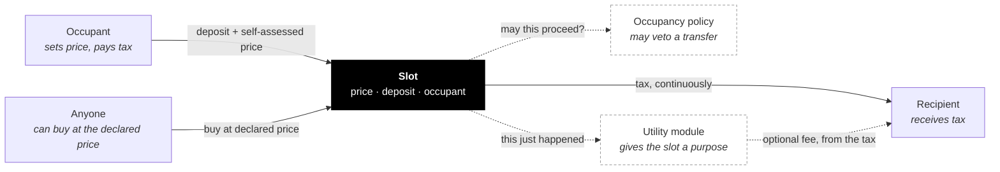
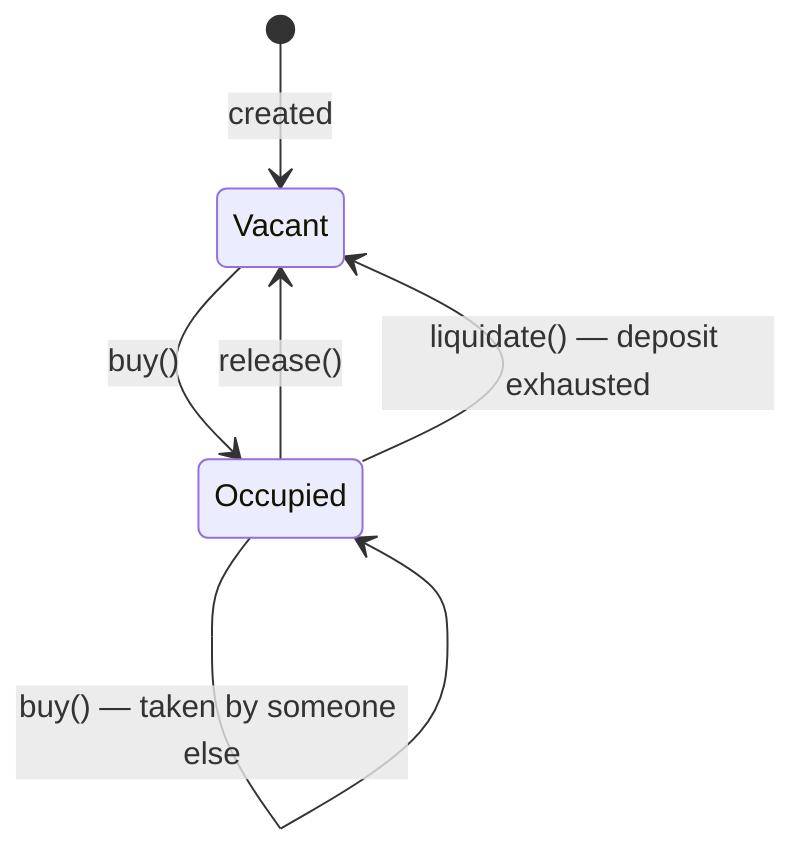

import { Callout } from 'vocs'

# How a slot works

A slot is one contract holding one position. An **occupant** holds it, at a
**price** they set themselves, paying tax to a **recipient**.

Three rules:

1. **You set your own price**, publicly.
2. **You pay tax on that price**, per second, from a deposit.
3. **Anyone can buy it from you at that price**, at any time.

Rule 2 punishes declaring too high. Rule 3 punishes declaring too low.

## The parts

| Part | Required | What it does |
|---|---|---|
| **Occupant** | — | Holds the slot, sets the price, pays the tax |
| **Recipient** | yes | Receives the tax. Fixed at creation, never changes |
| **Occupancy policy** | no | Can veto a buy or price change. Never moves money |
| **Utility module** | no | Gives the slot a purpose — ads, naming, content, access |
| **Manager** | no | May change what was declared changeable at creation |

Solid lines move value. Dashed lines are optional.

## Price and deposit are different

Confusing these is the most common mistake.

- **Price** — what you say it is worth. A standing offer to anyone. Not held by
  the contract.
- **Deposit** — real tokens you put in, which tax is drawn from. When it runs
  out you can be liquidated.

`minDepositSeconds` sets how much deposit a buy must bring: enough to cover that
many seconds of tax at the declared price. It stops someone taking a slot with a
huge price and no means to pay for it.

## Lifecycle

Tax accrues per second. Nothing runs on a timer — the contract settles whatever
is owed at the start of every interaction, so the numbers are correct whenever
anyone looks.

`collect()` pushes accrued tax to the recipient and is permissionless.

## Liquidation

When the deposit hits zero, anyone may call `liquidate()`. The slot goes vacant
and the caller earns `liquidationBountyBps` — taken from the **collected tax**,
not from anyone's deposit.

<Callout type="warning">
No occupancy policy can prevent liquidation, and none can stop an occupant
leaving. `liquidate()` and `release()` never consult one.
</Callout>

## Roles

| Role | Set | Can |
|---|---|---|
| **Occupant** | by buying | Set price, top up, withdraw surplus, release |
| **Operator** | by the occupant | Act for the occupant — delegate price changes without handing over the slot |
| **Recipient** | at creation, forever | Receive tax. Nothing else |
| **Manager** | at creation | Propose changes, only to what was declared mutable |

A slot is immutable by default. `mutableTax`, `mutableUtility` and
`mutablePolicy` are three separate promises, and a manager only exists if at
least one is true.

Recipient and manager are different jobs on purpose — "receives money" and "has
admin powers" should not be the same authority. When you *do* want one address
doing both, without collapsing it into one person, that is what a
[collective](/concepts/collectives) is for.

---

## Design notes

### Why all three rules, or none

Remove any one and the other two stop working. A price with no tax is a bluff. A
tax with no forced sale is just rent. Forced sale with no self-assessment needs
someone else to set the price — which is the problem the whole design avoids.

### Why mutability is three flags

You might want a swappable ad module on occupancy terms that never change.
Conflating them would make that inexpressible — and would let a slot advertising
"the module may change" quietly also reserve the right to change who is allowed
to take it.

## Next

- [Occupancy](/concepts/occupancy) — why a slot might refuse a sale
- [Utility modules](/concepts/modules) — how a slot gets a purpose
- [Slot reference](/reference/slot) — the full contract API
