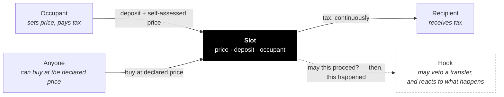
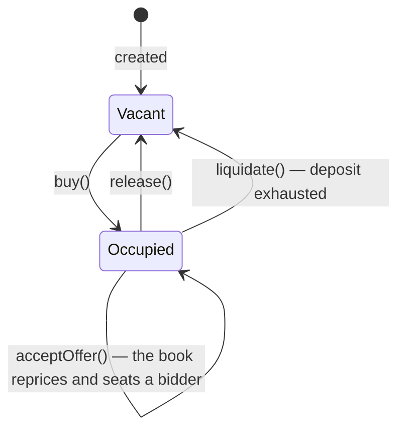

import { Callout } from 'vocs'

# How a slot works

A slot is one contract holding one position. An **occupant** holds it, at a
**price** they set themselves, paying tax to a **recipient**.

Three rules:

1. **You set your own price**, publicly.
2. **You pay tax on that price**, per second, from a deposit.
3. **Anyone can buy it from you at that price**, at any time.

Rule 2 punishes declaring too high. Rule 3 punishes declaring too low.

## The parts

| Part | Required | What it does |
|---|---|---|
| **Occupant** | — | Holds the slot, sets the price, pays the tax |
| **Recipient** | yes | Receives the tax. Fixed at creation, never changes |
| **Hook** | no | One address that both vetoes transfers (who may hold) and reacts to them (what holding grants). Never moves the price |
| **Manager** | no | May change what was declared changeable at creation |

Solid lines move value. Dashed lines are optional.

## Price and deposit are different

Confusing these is the most common mistake.

- **Price** — what you say it is worth. A standing offer to anyone. Not held by
  the contract.
- **Deposit** — real tokens you put in, which tax is drawn from. When it runs
  out you can be liquidated.

`minDepositSeconds` sets how much deposit a buy must bring: enough to cover that
many seconds of tax at the declared price. It stops someone taking a slot with a
huge price and no means to pay for it.

## Lifecycle

Tax accrues per second. Nothing runs on a timer — the contract settles whatever
is owed at the start of every interaction, so the numbers are correct whenever
anyone looks.

`collect()` pushes accrued tax to the recipient and is permissionless.

## Liquidation

When the deposit hits zero, anyone may call `liquidate()`. The slot goes vacant.
There is **no bounty** — the reward is the slot: a vacant slot costs only the
taker's own deposit, so whoever actually wants it can evict and buy it in one
transaction. Nobody's deposit is touched, and no accrued tax is spent on keepers.

<Callout type="warning">
No hook can prevent liquidation, and none can stop an occupant leaving. Both
paths tell the hook what happened, on a fixed gas budget, and ignore it if it
fails.

The one exception is a hook that declares `strict`, which runs uncapped and can
fail the transaction. Whether a slot's hook did that is fixed when it attaches
and readable before you buy.
</Callout>

## Roles

| Role | Set | Can |
|---|---|---|
| **Occupant** | by buying | Set price, top up, withdraw surplus, release |
| **Operator** | by the occupant | Act for the occupant — delegate price changes without handing over the slot |
| **Recipient** | at creation, forever | Receive tax. Nothing else |
| **Manager** | at creation | Propose changes, only to what was declared mutable |

A slot is immutable by default. Its tax and its hook are separate mutability
promises — you can freeze one and leave the other open — and a manager only
exists if at least one is true.

Recipient and manager are different jobs on purpose — "receives money" and "has
admin powers" should not be the same authority. Either can be a plain address or
a contract that shares the role among several parties.

---

## Design notes

### Why all three rules, or none

Remove any one and the other two stop working. A price with no tax is a bluff. A
tax with no forced sale is just rent. Forced sale with no self-assessment needs
someone else to set the price — which is the problem the whole design avoids.

### Why tax and hook are separate promises

Two flags rather than one, because the two guarantees are different sizes. A
slot can fix its tax rate forever and still let its manager swap the hook — an ad
space whose owner changes what renders in it, at a rate the occupant can count
on for as long as they hold it.

A single "mutable" flag could not say that. Worse, a slot advertising that its
hook may change would also be reserving the right to reprice its occupant, which
is the larger of the two powers by far.

## Next

- [Hooks](/concepts/hooks) — how a slot gets a purpose, and when it can refuse a buy
- [Slot reference](/reference/slot) — the full contract API
