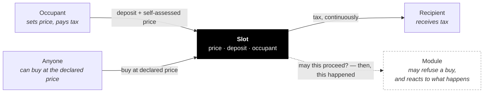
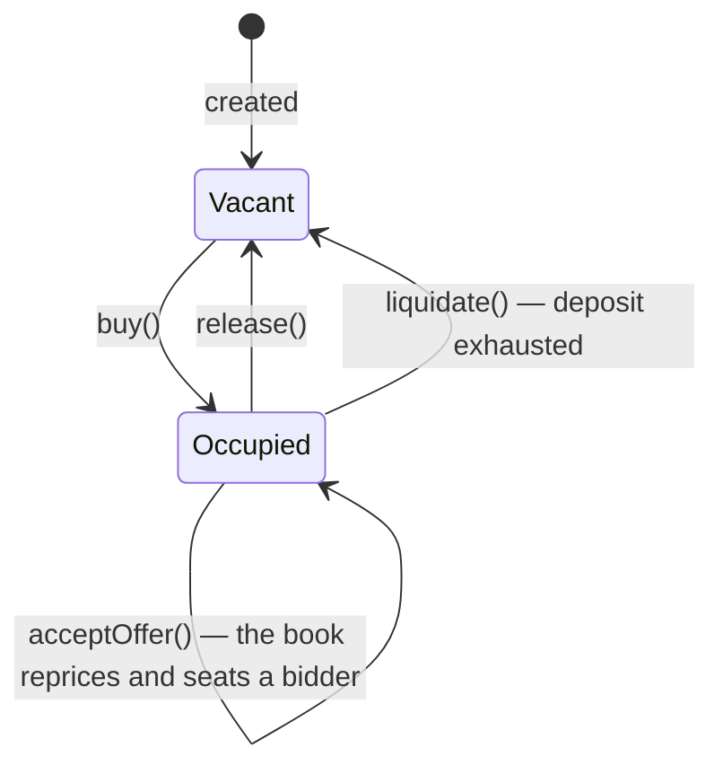

import { Callout } from 'vocs'

# How a slot works

A slot is one contract holding one position. An **occupant** holds it, at a
**price** they set themselves, paying tax to a **recipient**.

Three rules:

1. **You set your own price**, publicly.
2. **You pay tax on that price**, per second, from a deposit.
3. **Anyone can buy it from you at that price**, at any time.

Rule 2 punishes declaring too high. Rule 3 punishes declaring too low.

## The parts

```mermaid
flowchart LR
    Occupant["Occupant<br/><i>sets price, pays tax</i>"]
    Slot["<b>Slot</b><br/>price · deposit · occupant"]
    Recipient["Recipient<br/><i>receives tax</i>"]
    Module["Module<br/><i>may refuse a buy,<br/>and reacts to what happens</i>"]
    Buyer["Anyone<br/><i>can buy at the declared price</i>"]

    Occupant -->|"deposit + self-assessed price"| Slot
    Buyer -->|"buy at declared price"| Slot
    Slot -->|"tax, continuously"| Recipient
    Slot -.->|"may this proceed? — then, this happened"| Module

    classDef core fill:#000,stroke:#000,color:#fff
    classDef opt fill:#fff,stroke:#999,stroke-dasharray:4 3,color:#333
    class Slot core
    class Module opt
```

| Part | Required | What it does |
|---|---|---|
| **Occupant** | — | Holds the slot, sets the price, pays the tax |
| **Recipient** | yes | Receives the tax, less any module fee |
| **Module** | no | One contract that may refuse a buy or a reprice, and is told what happened. Never moves the price |
| **Manager** | only if something is mutable | Queues changes to whatever was declared mutable |

Solid lines move value. Dashed lines are optional.

## Price and deposit are different

Confusing these is the most common mistake.

- **Price** — what you say it is worth. A standing offer to anyone. Not held by
  the contract.
- **Deposit** — real tokens you put in, which tax is drawn from. When it runs
  out you can be liquidated.

`minRunwaySeconds` sets how much deposit a buy must bring: enough to cover that
many seconds of tax at the declared price, rounded up. It stops someone taking a
slot with a huge price and no means to pay for it. `selfAssess` and `withdraw`
enforce the same floor against a sitting occupant.

## Lifecycle

```mermaid
stateDiagram-v2
    [*] --> Vacant: created
    Vacant --> Occupied: buy()
    Occupied --> Occupied: selfAssess() / topUp() / withdraw()
    Occupied --> Occupied: buy() — taken by someone else
    Occupied --> Occupied: acceptOffer() — the book reprices and seats a bidder
    Occupied --> Vacant: release()
    Occupied --> Vacant: liquidate() — deposit exhausted
```

Tax accrues per second, at `rateBps` basis points of the price per 30 days.
Nothing runs on a timer — the contract settles whatever is owed at the start of
every interaction, so the numbers are correct whenever anyone looks.

`collect()` pays accrued tax out — the module's fee, if it takes one, then the
recipient — and is permissionless.

## Liquidation

When the deposit hits zero, anyone may call `liquidate()`. The slot goes vacant.
There is **no bounty** — the reward is the slot: a vacant slot costs only the
taker's own deposit, so whoever actually wants it can evict and buy it in one
transaction.

Tax the deposit could not cover is not forgiven. It is carried as debt against
the occupant's address and repaid out of their next buy, buyout proceeds or
top-up on that slot.

<Callout type="warning">
No module can prevent liquidation, and none can stop an occupant leaving. Both
paths tell the module what happened, on a fixed gas budget, and ignore it if it
fails.

The one exception is a module that declares `strict`, whose `after` callbacks
run uncapped and can fail the transaction. Whether a slot's module did that is
readable from `scopes()` before you buy, and cannot change under a sitting
occupant.
</Callout>

## Roles

| Role | Set | Can |
|---|---|---|
| **Occupant** | by buying | Set price, top up, withdraw surplus, release, apply ripe terms early |
| **Operator** | by the occupant | Reprice for the occupant — the grant lapses with the tenure |
| **Recipient** | at creation | Receive tax. Nothing else |
| **Manager** | at creation | Queue changes to what was declared mutable, accept the module's new fee or scopes, hand over the role |

A slot is immutable by default. Its tax (rate and minimum runway), its
recipient and its module are three separate mutability promises, fixed at
creation. A manager is required exactly when at least one of them is true, and
forbidden otherwise.

## Terms do not move under an occupant

A manager's changes only ever **queue**. They wait `TERMS_DELAY` (one hour) and
then land at the next `buy` — so the terms you bought into hold for as long as
you hold the slot. The occupant may land ripe terms sooner with `applyTerms()`,
and once the slot is vacant anyone may.

The one change that takes effect at once is a module's **fee**, when the
manager accepts it with `acceptFee`. It changes how collected tax is split between
the module and the recipient, never what the occupant pays.

Recipient and manager are different jobs on purpose — "receives money" and "has
admin powers" should not be the same authority. Either can be a plain address or
a contract that shares the role among several parties, such as a
`SlotCollective`.

## Why all three rules, or none

Remove any one and the other two stop working. A price with no tax is a bluff. A
tax with no forced sale is just rent. Forced sale with no self-assessment needs
someone else to set the price — which is the problem the whole design avoids.

## Next

- [Modules](/concepts/modules) — how a slot gets a purpose, and when it can refuse a buy
- [Slot reference](/reference/slot) — the full contract API
